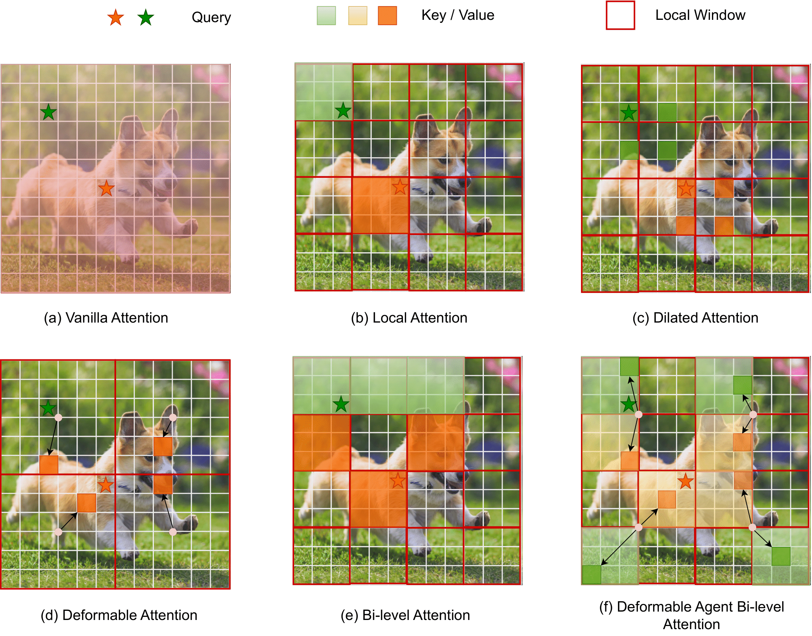

# [DeBiFormer: Vision Transformer with Deformable Agent Bi-level Routing Attention](https://arxiv.org/pdf/2410.08582)

Official PyTorch implementation of **DeBiFormer**, from the following paper:

[DeBiFormer: Vision Transformer with Deformable Agent Bi-level Routing Attention](https://arxiv.org/pdf/2410.08582). ACCV 2024.\
[Nguyen Huu Bao Long](https://github.com/maclong01), [Chenyu Zhang](https://github.com/il1um), Yuzhi Shi, [Tsubasa Hirakawa](https://thirakawa.github.io/), [Takayoshi Yamashita](https://scholar.google.co.jp/citations?user=hkguTPgAAAAJ&hl=en), [Hironobu Fujiyoshi](https://scholar.google.com/citations?user=CIHKZpEAAAAJ&hl=en), and [Tohgoroh Matsui](https://xn--p8ja5bwe1i.jp/profile.html)


--- 
<p align="left">

</p>


<!-- ✅ ⬜️  -->

## News

* 2024-09-21: The paper has been accepted at ACCV 2024 !!!

## Results and Pre-trained Models

### ImageNet-1K trained models

| name | resolution |acc@1 | #params | FLOPs | model | log |
|:---:|:---:|:---:|:---:| :---:|:---:|:---:|
| DeBiFormer-T | 224x224 | 81.9 | 21.4 M | 2.6 G | [model](https://drive.google.com/drive/folders/1K_Zk5Etx2oh3yVccr71m1R3bTqWAI2bg) | [log](https://drive.google.com/drive/folders/1K_Zk5Etx2oh3yVccr71m1R3bTqWAI2bg) |
| DeBiFormer-S | 224x224 | 83.9 | 44 M | 5.4 G | [model](https://drive.google.com/drive/folders/1OmWKob1ECHgVMs5wSvZs3XF665zFJdHg) | [log](https://drive.google.com/drive/folders/1OmWKob1ECHgVMs5wSvZs3XF665zFJdHg) |
| DeBiFormer-B | 224x224 | 84.4 | 77 M | 11.8 G | [model](https://drive.google.com/drive/folders/1Ae3l2Q9nPbpOgSiTtX_HWyvSXIPQ9jce) | [log](https://drive.google.com/drive/folders/1Ae3l2Q9nPbpOgSiTtX_HWyvSXIPQ9jce) | 


# Usage

First, clone the repository locally:
```
git clone https://github.com/maclong01/DeBiFormer.git
pip3 install -r requirements.txt
```
## Data preparation

Download and extract ImageNet train and val images from http://image-net.org/.
The directory structure is the standard layout for the torchvision [`datasets.ImageFolder`](https://pytorch.org/docs/stable/torchvision/datasets.html#imagefolder), and the training and validation data is expected to be in the `train/` folder and `val/` folder respectively:

```
/path/to/imagenet/
  train/
    class1/
      img1.jpeg
    class2/
      img2.jpeg
  val/
    class1/
      img3.jpeg
    class/2
      img4.jpeg
```


#### Training

To train DeBiFormer-S on ImageNet  using 8 gpus for 300 epochs, run:

```shell
cd classification/
bash train.sh 8 --model debiformer_small --batch-size 256 --lr 5e-4 --warmup-epochs 20 --weight-decay 0.1 --data-path your_imagenet_path
```

#### Evaluation 

To evaluate the performance of DeBiFormer-S on ImageNet using 8 gpus, run:
```shell
cd classification/
bash train.sh 8 --model debiformer_small --batch-size 256 --lr 5e-4 --warmup-epochs 20 --weight-decay 0.1 --data-path your_imagenet_path --resume ../checkpoints/debiformer_small_in1k_224.pth --eval
```


## Acknowledgement
This repository is built using the [timm](https://github.com/rwightman/pytorch-image-models) library, [DAT](https://github.com/LeapLabTHU/DAT), and [BiFormer](https://github.com/rayleizhu/BiFormer) repositories.

## License
This project is released under the MIT license. Please see the [LICENSE](LICENSE) file for more information.

## Citation
If you find this repository helpful, please consider citing:
```bibtex
@Article{baolong2024debiformer,
  author  = {NguyenHuu BaoLong and Chenyu Zhang and Yuzhi Shi and Takayoshi Yamashita and Tsubasa Hirakawa and Hironobu Fujiyoshi and Tohgoroh Matsui},
  title   = {DeBiFormer: Vision Transformer with Deformable Agent Bi-level Routing Attention},
  journal = {Proceedings of the IEEE/CVF Asian Conference on Computer Vision (ACCV)},
  year    = {2024},
}
```
